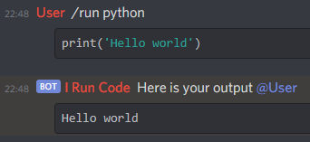

# I Run Code

Source code for the "I Run Code" Discord Bot used to run code snippets inside Discord chats.



You can add me to your server [here](https://emkc.org/run) 

To see a list of supported languages click [here](https://github.com/engineer-man/piston-bot/blob/master/src/cogs/run.py#L29)

If you have questions check by our [Discord Server](https://discord.com/invite/engineerman)

[engineer-man/piston](https://github.com/engineer-man/piston) is the api that actually runs the code.

# How to use
## Basic Syntax

````
/run [language]
```[syntax]
<your code>
```
````

* You have to provide either `language` or `syntax`

## Provide command line arguments
````
/run [language]
[arg1]
[arg2]
```[syntax]
<your code>
```
````
* You can provide command line arguments by specifying them before the codeblock
* Each line corresponds to one argument

## Provide standard input
````
/run [language]
```[syntax]
<your code>
```
[input]
````
* You can provide standard input by specifying it after the codeblock

## Use a file instead of a codeblock

````
/run [language]
[args1]
[args2]

[stdin1]
[stdin2]

<attached_file>
```` 
* You can attach a file with source code instead of providing a codeblock
  * If you don't specify the language the bot will use the file extension 
  * You can specify command line arguments and stdin in the command. 
    * command line arguments should directly follow the `/run` line
    * stdin is everything that follows after the first double newline
* Please note that attachments can not be edited therefore you can not use the edit functionality if you provide a source file

## Editing and deleting messages
+ You can edit your last `/run` message if you make a mistake and the bot will edit it's initial response.  
+ You can delete the last output message (that was caused by you) with `/delete` or `/del` or by deleting your most recent `/run` message

# Contributing
If you want to contribute you can just submit a pull request.
### Code styling / IDE Settings
Please style your code according to these guidelines:
* maximum line length is 99 columns 
* use 4 spaces for indentation
* files end with a newline 
* lines should not have trailing whitespace

If you want to use an auto formatter please use `autopep8`

Example config for VSCode:
```
"[python]": {
    "editor.rulers": [
        99
    ],
    "editor.tabSize": 4,
},
"files.insertFinalNewline": true,
"files.trimTrailingWhitespace": true,
"editor.trimAutoWhitespace": true,
"python.formatting.provider": "autopep8",
"python.formatting.autopep8Args": ["--max-line-length", "99"],
```


# What's new

## 2020-11-29
Added `delete` functionality.  
* The `/delete` or `/del` command will make the bot delete it's last output (that was caused by the caller)  
* If you delete your most recent `/run` message the corresponding output will also be deleted.

## 2020-08-04
Made writing rust code "snippets" easier (Thanks https://github.com/UsairimIsani)
```rust
fn main() { }
```
will be automatically created if it is not present in the provided code.

## 2020-07-16
Made writing java code "snippets" easier (Thanks https://github.com/Minecraftian14)

When typing Java code the boilerplate code for `public class` will be added automatically.
````java
/run java
```
import java.util.List;
List.of(args).forEach(System.out::println);
```
````
will be interpreted as
````java
/run java
```
import java.util.List;
public class temp extends Object {
  public static void main(String[] args) {
    List.of(args).forEach(System.out::println);
  }
}
```
````


## 2020-07-15
Added optional command line parameters
You can use them by specifying them before the codeblock (1 per line)  

Example:
````
/run <language>
parameter 1
parameter 2
```
<your code>
```
````

## 2021-02-05
Added optional standard input
You can use standard input by specifying it after the codeblock 

Example:
````
/run <language>
```
<your code>
```
standard input
````
